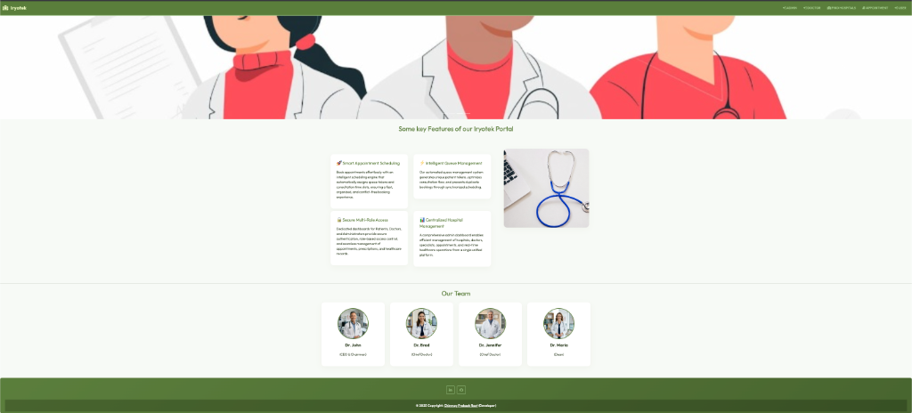
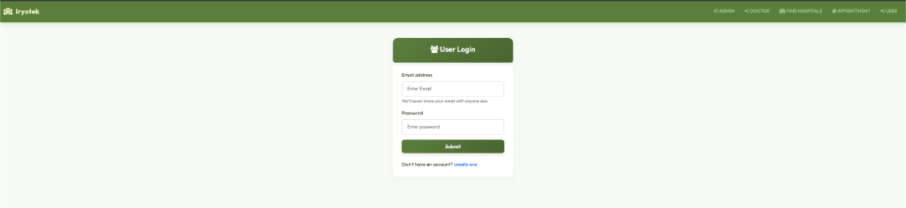
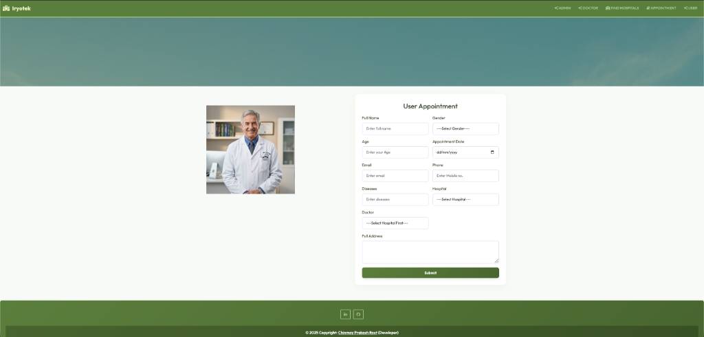
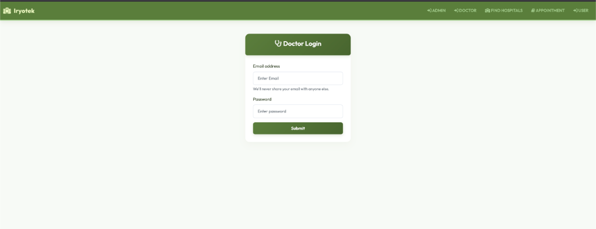
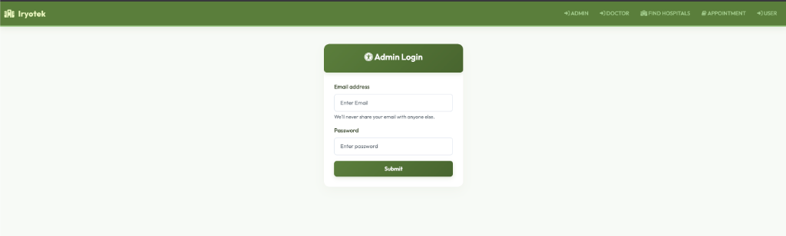
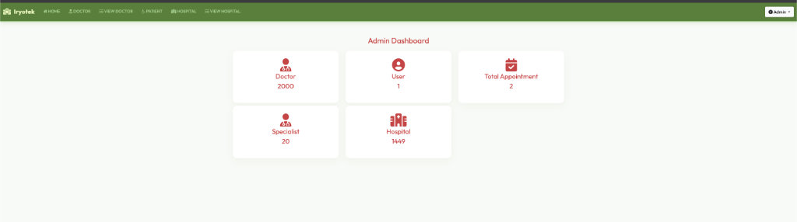
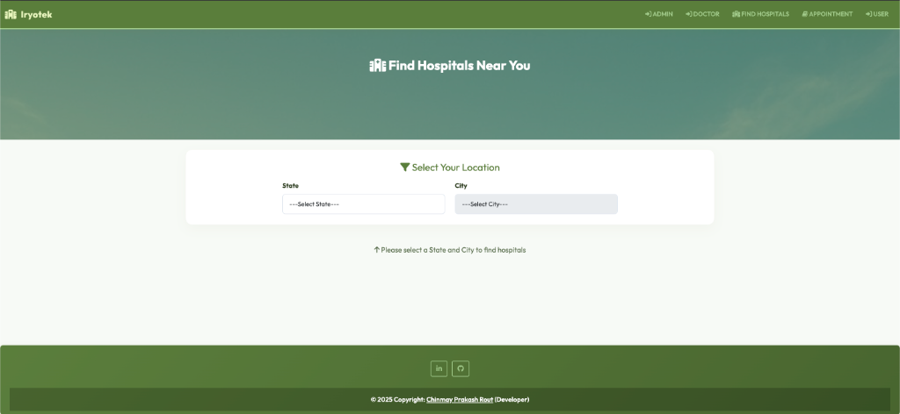

# Iryotek — Advanced Doctor-Patient Portal & Clinic Queue System

**Iryotek** is a responsive, feature-rich Java Web application designed to streamline clinic workflows, improve the patient scheduling experience, and provide robust healthcare management tools. 

The application features a modern, clean clinical-green interface, customized typography, and is structured around three primary user roles: Patients, Doctors, and Administrators.

---

## Key Features

* **Smart Appointment Booking**: Patients can easily locate available doctors, choose appointment dates, and book consultations.
* **Collision-Free Queue Allocation**: Features a synchronized booking mechanism that automatically generates sequential queue token numbers and assigns precise 15-minute time slots (starting at 09:00 AM) to prevent scheduling conflicts.
* **Instant Booking Modal**: A confirmation modal pops up immediately upon successful booking to show the patient their queue token and time slot.
* **Role-Based Portals**: Secure, dedicated login environments for Patients, Doctors, and Administrators.
* **Prescription & Remarks Logging**: Doctors can review scheduled appointments, input treatment remarks, diagnostic info, and prescriptions directly into patient records.
* **Centralized Hospital Management**: Administrators can add and manage hospital branches, specialists, configure medical departments, onboard doctors, and monitor all appointments.

---

## Technology Stack

* **Backend**: Java 8 (Servlets, JSP, JSTL, JDBC Connection Pooling)
* **Frontend**: HTML5, CSS3, Bootstrap 5, FontAwesome (Clinical-green custom color theme)
* **Database**: MySQL 8.x
* **Build & Dependency Management**: Maven
* **Web Container**: Apache Tomcat 9.x

---

## Screenshot Walkthrough

### 🏠 Homepage
The main landing page for Iryotek showing clinical service options, quick navigation headers, and entry points for patients, doctors, and admins.



---

### 👤 Patient Experience
* **Login & Authentication**: Secure sign-in portal for patients.
  

* **Scheduling an Appointment**: Patient appointment scheduling interface.
  

---

### 🥼 Doctor Portal
* **Doctor Sign-In**: Dedicated login portal for registered medical practitioners.
  

---

### 📊 Administrative Dashboard
* **Admin Authentication**: Secure entry point for portal managers.
  

* **Admin Control Center**: Key metrics tracker showing total doctors, users, scheduled appointments, configured specialties, and branches.
  

---

### 🏥 Hospital Finder
* **Branch Directory**: A public or patient-accessible directory listing branches, clinics, and affiliated hospitals.
  

---

## Local Setup & Installation

### 1. Prerequisites
Before setting up the project locally, ensure you have installed:
* **Java Development Kit (JDK) 8** or higher
* **Apache Tomcat 9.x**
* **MySQL Server** (ensure the MySQL service is active)
* **Apache Maven**

### 2. Database Setup
1. Open your terminal and connect to your MySQL instance:
   ```bash
   mysql -u root -p
   ```
2. Create the target database:
   ```sql
   CREATE DATABASE hospital;
   ```
3. Import the database schema and seed data to populate initial entries (specialists, hospitals, and doctor accounts):
   ```bash
   mysql -u root -p hospital < seed_data.sql
   ```

### 3. Build the Application
Use Maven to clean the directory, resolve dependencies, and compile the project into a Web Archive (WAR) package:
1. Navigate to the core project directory:
   ```bash
   cd Iryotek
   ```
2. Build the package:
   ```bash
   mvn clean package
   ```
   This compiles the project and generates `Iryotek.war` inside the `target/` directory.

### 4. Deploy to Tomcat
1. Copy the generated `Iryotek.war` file to your Tomcat container's `webapps/` folder:
   ```bash
   cp target/Iryotek.war /path/to/tomcat/webapps/
   ```
2. Start or restart your Tomcat server. Tomcat will automatically extract the archive and serve it.
3. Access the application in your browser:
   ```
   http://localhost:8080/Iryotek/
   ```
